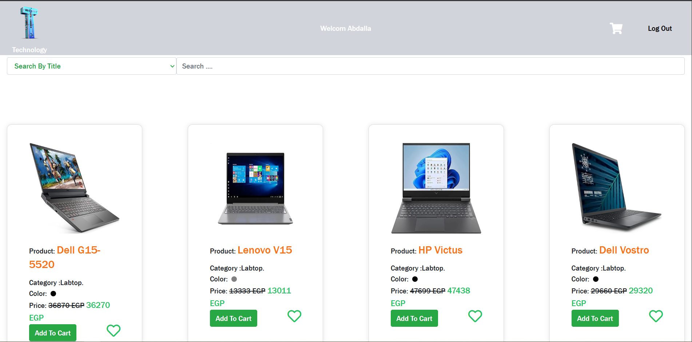

# 🌐 Web Master Phase One Task Two  

This project is a simple **HTML, CSS, and JavaScript** web application, built as part of a practical training task for mastering web development fundamentals.  
It includes a landing page, internal pages, and dynamic interactions using JavaScript.  

---

## 📂 Project Structure

Web_Master_Phase_One_Task_Two/
│── index.html # Main landing page
│── Css/ # CSS stylesheets
│── Js/ # JavaScript files
│── Pages/ # Internal pages
│── images/ # Project images
│── fonts/ # Local fonts
│── README.md # Project description

---

## 🚀 Live Demo
Check out the project hosted on **GitHub Pages**:  
# 👉 [View Demo](https://abdalla-yahia.github.io/Web_Master_Phase_One_Task_Two/)

---

## 🛠️ Technologies Used
- **HTML5** → Page structure  
- **CSS3** → Styling and responsive design  
- **JavaScript (ES6)** → Interactivity and data fetching  
- **Google Fonts / Local Fonts** → Custom typography  
- **GitHub Pages** → Hosting and deployment  

---

## ✨ Features
- Fully responsive design across devices  
- Dynamic product loading using `fetch`  
- Organized file structure (CSS, JS, Pages, Images, Fonts)  
- Smooth and interactive user experience  

---

## 📸 Screenshots

---
## 👨‍💻 Contact
- **Name:** Abdalla Yahia  
- **GitHub:** [abdalla-yahia](https://github.com/abdalla-yahia)  
- **LinkedIn:** [linkedin.com/in/abdalla-yahia](https://linkedin.com/in/abdalla-yahia)  

---

## 📜 License
This project was provided as a **training task** by the **Web Master learning platform**.  
It was completed for **educational purposes** only, focusing on practicing HTML, CSS, and JavaScript by fixing errors and improving the given template.  

Not intended for commercial use.

